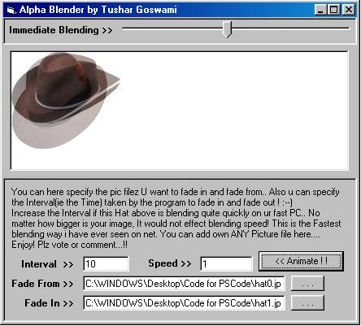



## Alpha Blender \(Sexy fade in and fade out of Pictures\)

### Description

Hello Everybody!..

This is an Alpa Blender project.. That is : it uses two image files(which u give ofcourse;).. And it fades them in and out in the SIMPLEST possible way.. It is faster too;--) You can specify the program the interval(time) to take to fade in and out.. It uses only one main API to do so called : "AlphaBlend". And it is Flicker-free too. The code is FULLY Commented! Enjoy!.. I would appreciate your votes and comments,! :)

Update : Now I have added a slider control too on the form, So that you can see the Fastest Blending speed of this program in action. This is the Fastest Blending program i have ever seen on net;) No matter how bigger are your blending images, it would not effect the blending speed :) Please vote
 
### More Info
 

             |
---                |---
**Submitted On**   |2003-03-10 10:00:10
**By**             |[ThinkBase](https://github.com/Planet-Source-Code/PSCIndex/blob/master/ByAuthor/thinkbase.md)
**Level**          |Intermediate
**User Rating**    |4.8 (67 globes from 14 users)
**Compatibility**  |VB 4\.0 \(32\-bit\), VB 5\.0, VB 6\.0
**Category**       |[Graphics](https://github.com/Planet-Source-Code/PSCIndex/blob/master/ByCategory/graphics__1-46.md)
**World**          |[Visual Basic](https://github.com/Planet-Source-Code/PSCIndex/blob/master/ByWorld/visual-basic.md)
**Archive File**   |[Alpha\_Blen1557663102003\.zip](https://github.com/Planet-Source-Code/thinkbase-alpha-blender-sexy-fade-in-and-fade-out-of-pictures__1-43879/archive/master.zip)

